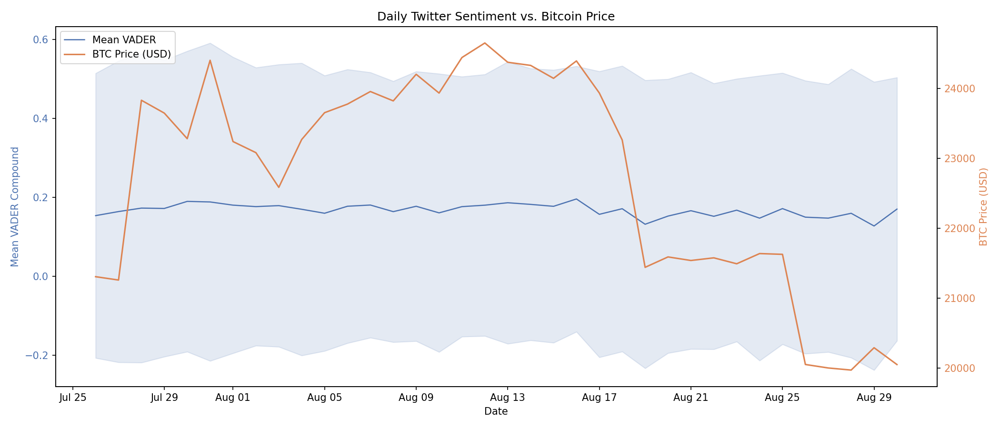
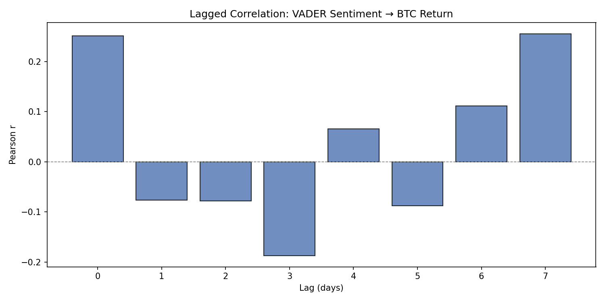
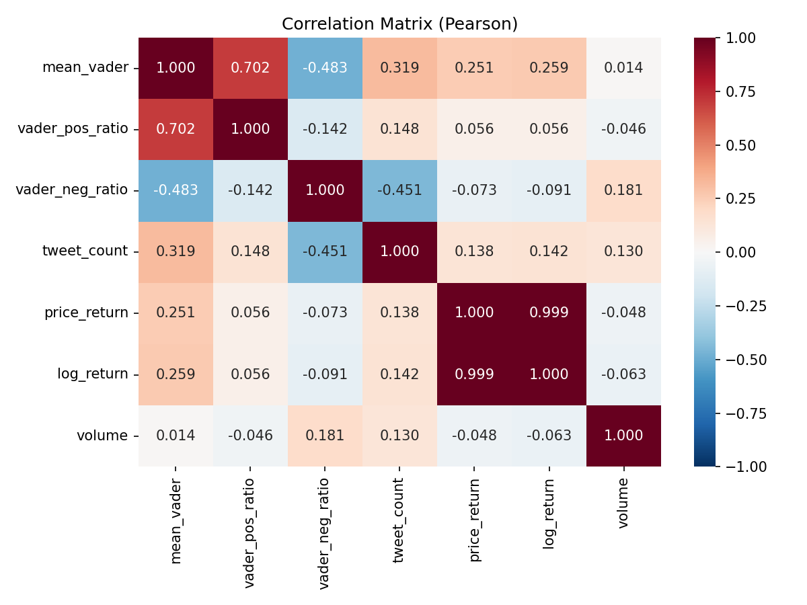
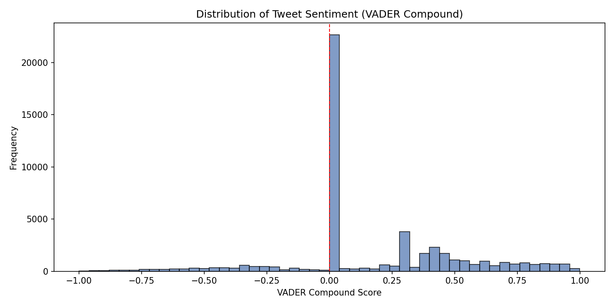
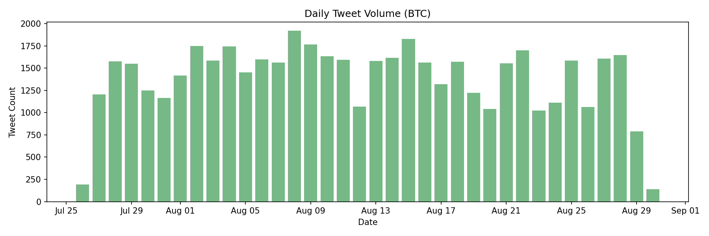
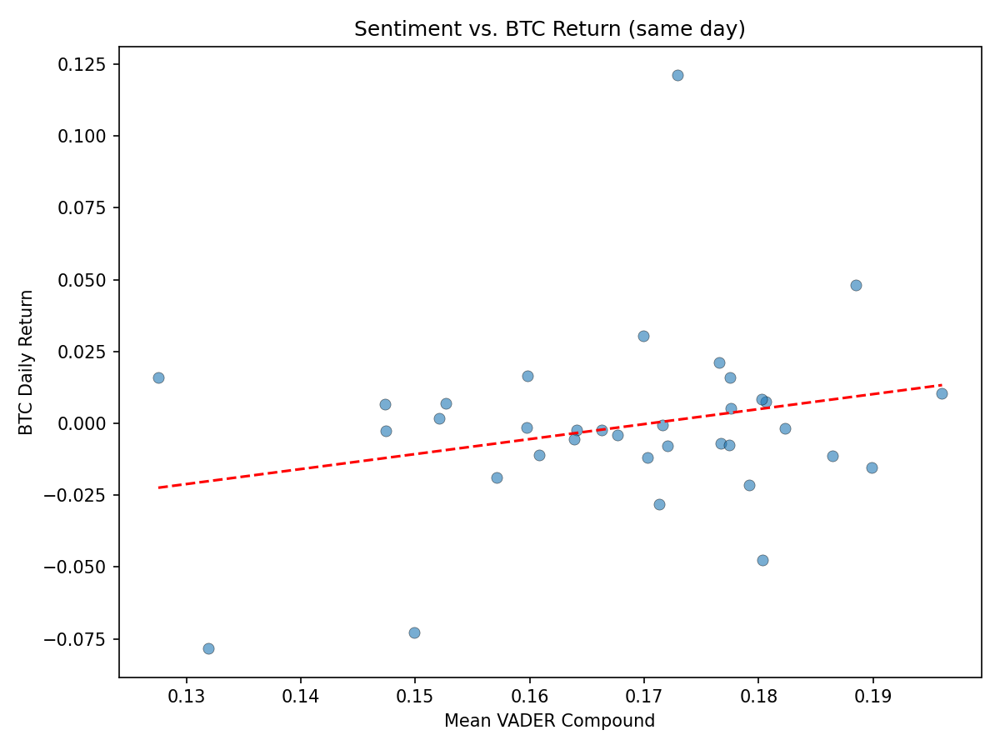
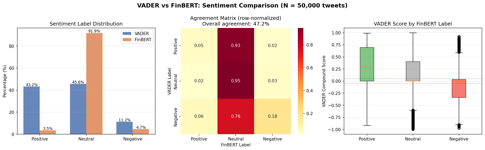

# Crypto Sentiment Analysis

> **Тема:** «Анализ тональности сообщений пользователей социальных сетей и оценка их влияния на динамику цен криптовалют»
>
> **Студент:** Мугари Абдеррахим, группа: НФИбд-01-22
>
> **Науч. рук.:** доц., к.т.н. Молодченков А.И.

Analysing the relationship between **Twitter sentiment** and **Bitcoin price movements** using NLP (VADER + FinBERT) and statistical methods (Pearson/Spearman correlation, Granger causality).

## Project Structure

```
crypto-sentiment-analysis/
├── .github/workflows/ci.yml    # GitHub Actions CI pipeline
├── data/
│   ├── raw/tweets.csv          # 664,918 English BTC tweets (Jul-Aug 2022)
│   └── processed/              # Cleaned & merged outputs
├── src/
│   ├── data_loader.py          # Load & validate tweet data
│   ├── preprocessor.py         # Text cleaning & tokenisation
│   ├── sentiment_analyzer.py   # VADER & FinBERT scoring
│   ├── price_fetcher.py        # CoinGecko BTC price retrieval
│   └── correlation_analyzer.py # Correlation & Granger analysis
├── tests/                      # Pytest test suite (28 tests)
├── results/
│   ├── figures/                # Generated charts (PNG)
│   ├── tables/                 # Statistical results (CSV)
│   ├── finbert_torchinfo.txt   # FinBERT architecture summary
│   └── finbert_architecture.onnx # ONNX model for Netron
├── notebooks/                  # Exploratory analysis
├── main.py                     # End-to-end pipeline
├── requirements.txt            # Python dependencies
└── README.md
```

## Dataset

**Source:** Twitter/X API extraction — BTC-related tweets (July 26 – August 30, 2022).

- **Total tweets:** 664,918 (English, deduplicated)
- **Date range:** 2022-07-26 to 2022-08-30 (36 days)
- **Daily average:** ~18,470 tweets

| Column          | Description                          |
| --------------- | ------------------------------------ |
| `created_at`    | Tweet timestamp (UTC)                |
| `id`            | Unique tweet ID                      |
| `full_text`     | Raw tweet text                       |
| `retweet_count` | Number of retweets                   |
| `favorite_count`| Number of likes                      |
| `lang`          | ISO 639-1 language code              |

## Setup

```bash
# 1. Clone and enter directory
git clone <repo-url> && cd crypto-sentiment-analysis

# 2. Create virtual environment (recommended)
python -m venv venv
source venv/bin/activate  # Linux/Mac
venv\Scripts\activate     # Windows

# 3. Install CPU-only PyTorch (faster, no GPU needed)
pip install torch --index-url https://download.pytorch.org/whl/cpu

# 4. Install all dependencies
pip install -r requirements.txt
```

## Usage

```bash
# Full pipeline (VADER + FinBERT)
python main.py

# VADER-only mode (fast, ~10 min)
python main.py --skip-finbert --skip-torchinfo

# Subsample for quick testing
python main.py --skip-torchinfo --sample 50000
```

### Pipeline Steps

1. **Load** — Read English BTC tweets from `data/raw/tweets.csv`
2. **Preprocess** — Remove URLs, mentions, RT prefix; lowercase; tokenise
3. **Sentiment** — Score with VADER (raw text) and FinBERT (cleaned text)
4. **Model Summary** — torchinfo architecture report for FinBERT
5. **Price Data** — Fetch BTC/USD from CoinGecko (with fallback data)
6. **Aggregate** — Daily sentiment metrics merged with price data
7. **Analysis** — Lagged Pearson/Spearman correlations, Granger causality, ADF stationarity
8. **Visualise** — Generate all charts to `results/figures/`
9. **Export** — Save processed data to `data/processed/`

## Results

### Table 1: Daily Aggregated Sentiment & Price (sample)

| date       | tweet_count | mean_vader | vader_pos_ratio | vader_neg_ratio | price  | price_return |
|------------|-------------|------------|-----------------|-----------------|--------|--------------|
| 2022-07-26 | 191         | 0.1538     | 0.4084          | 0.1414          | 21306  | NaN          |
| 2022-07-27 | 1206        | 0.1641     | 0.4386          | 0.1517          | 21258  | -0.0023      |
| 2022-07-28 | 1577        | 0.1729     | 0.4445          | 0.1363          | 23832  | 0.1211       |
| 2022-07-29 | 1550        | 0.1720     | 0.4174          | 0.1355          | 23648  | -0.0077      |
| 2022-07-30 | 1249        | 0.1899     | 0.4732          | 0.1281          | 23282  | -0.0155      |
| 2022-07-31 | 1164        | 0.1885     | 0.4639          | 0.1418          | 24404  | 0.0482       |
| 2022-08-01 | 1416        | 0.1804     | 0.4386          | 0.1172          | 23241  | -0.0477      |
| 2022-08-02 | 1749        | 0.1767     | 0.4145          | 0.0961          | 23082  | -0.0068      |
| 2022-08-03 | 1586        | 0.1792     | 0.4559          | 0.1084          | 22585  | -0.0215      |
| 2022-08-04 | 1743        | 0.1699     | 0.3982          | 0.1170          | 23270  | 0.0303       |

### Table 2: Lagged Correlations (VADER sentiment -> BTC return)

| Lag (days) | Pearson r | Pearson p | Spearman r | Spearman p | N obs |
|------------|-----------|-----------|------------|------------|-------|
| 0          | 0.2509    | 0.1460    | 0.0944     | 0.5896     | 35    |
| 1          | -0.0761   | 0.6637    | -0.1417    | 0.4167     | 35    |
| 2          | -0.0776   | 0.6626    | -0.1129    | 0.5249     | 34    |
| 3          | -0.1872   | 0.2970    | -0.1083    | 0.5486     | 33    |
| 4          | 0.0657    | 0.7210    | 0.0700     | 0.7034     | 32    |
| 5          | -0.0880   | 0.6379    | 0.0185     | 0.9211     | 31    |
| 6          | 0.1115    | 0.5573    | 0.1408     | 0.4579     | 30    |
| 7          | 0.2556    | 0.1808    | 0.0744     | 0.7014     | 29    |

### Table 3: Granger Causality Test (VADER -> BTC return)

| Lag | F-statistic | p-value | Significant (p<0.05) |
|-----|-------------|---------|----------------------|
| 1   | 0.1271      | 0.7239  | No                   |
| 2   | 0.1189      | 0.8883  | No                   |
| 3   | 0.6516      | 0.5894  | No                   |
| 4   | 0.5049      | 0.7326  | No                   |
| 5   | 0.3342      | 0.8859  | No                   |
| 6   | 0.7402      | 0.6253  | No                   |
| 7   | 1.2834      | 0.3307  | No                   |

### Table 4: VADER vs FinBERT — Sentiment Label Distribution

| Label    | VADER count | VADER % | FinBERT count | FinBERT % |
|----------|-------------|---------|---------------|-----------|
| Positive | 21,613      | 43.23%  | 1,730         | 3.46%     |
| Neutral  | 22,796      | 45.59%  | 45,947        | 91.89%    |
| Negative | 5,591       | 11.18%  | 2,323         | 4.65%     |

**Agreement rate: 47.22%** — FinBERT classifies 92% of tweets as neutral, while VADER distributes more evenly. This demonstrates the fundamental difference between lexicon-based (VADER) and transformer-based (FinBERT) approaches in the crypto domain.

### Figure 1: Sentiment vs Price


### Figure 2: Lagged Correlations


### Figure 3: Correlation Heatmap


### Figure 4: Sentiment Distribution


### Figure 5: Tweet Volume


### Figure 6: Scatter - Sentiment vs Return


### Figure 7: VADER vs FinBERT Comparison


## FinBERT Architecture

### torchinfo Summary

```
==========================================================================================
Layer (type:depth-idx)                   Input Shape      Output Shape     Param #
==========================================================================================
BertForSequenceClassification            --               [1, 3]           --
├─BertModel: 1-1                         [1, 128]         [1, 768]         --
│    └─BertEmbeddings: 2-1               --               [1, 128, 768]    --
│    │    └─Embedding: 3-1               [1, 128]         [1, 128, 768]    23,440,896
│    │    └─Embedding: 3-2               [1, 128]         [1, 128, 768]    1,536
│    │    └─Embedding: 3-3               [1, 128]         [1, 128, 768]    393,216
│    │    └─LayerNorm: 3-4               [1, 128, 768]    [1, 128, 768]    1,536
│    │    └─Dropout: 3-5                 [1, 128, 768]    [1, 128, 768]    --
│    └─BertEncoder: 2-2                  [1, 128, 768]    [1, 128, 768]    --
│    │    └─ModuleList: 3-6 (x12 layers) --               --               85,054,464
│    └─BertPooler: 2-3                   [1, 128, 768]    [1, 768]         --
│    │    └─Linear: 3-7                  [1, 768]         [1, 768]         590,592
│    │    └─Tanh: 3-8                    [1, 768]         [1, 768]         --
├─Dropout: 1-2                           [1, 768]         [1, 768]         --
├─Linear: 1-3 (classifier)              [1, 768]         [1, 3]           2,307
==========================================================================================
Total params: 109,484,547
Trainable params: 109,484,547
Non-trainable params: 0
Params size (MB): 437.94
Estimated Total Size (MB): 544.90
==========================================================================================
```

### Netron Architecture Graph

The ONNX model (`results/finbert_architecture.onnx`) can be visualised at [netron.app](https://netron.app):


> **Note:** Open `results/finbert_architecture.onnx` at https://netron.app and take a screenshot manually.

## Testing

```bash
pytest tests/ -v
```

```
28 passed in 3.64s
```

Tests cover:
- **Preprocessor** — URL/mention removal, tokenisation, stopword filtering
- **Sentiment Analyzer** — VADER score range, polarity correctness, index preservation
- **Correlation Analyzer** — Aggregation, lag computation, Granger test, ADF test, matrix shape

## CI/CD

GitHub Actions runs on push/PR to `main`:
- Tests across Python 3.10, 3.11, 3.12
- Flake8 lint check

## Methodology

- **VADER** receives *raw* tweet text (capitalisation, punctuation, and emoji are tonal signals)
- **FinBERT** (ProsusAI/finbert, 109.5M parameters) receives *cleaned* text (URLs and mentions are noise for transformer embeddings)
- **FinBERT label distribution (50k sample):** 91.9% neutral, 4.6% negative, 3.5% positive
- Granger causality tests whether past sentiment values improve BTC return prediction beyond autoregressive baseline
- ADF test confirms stationarity before Granger testing

## License

MIT
